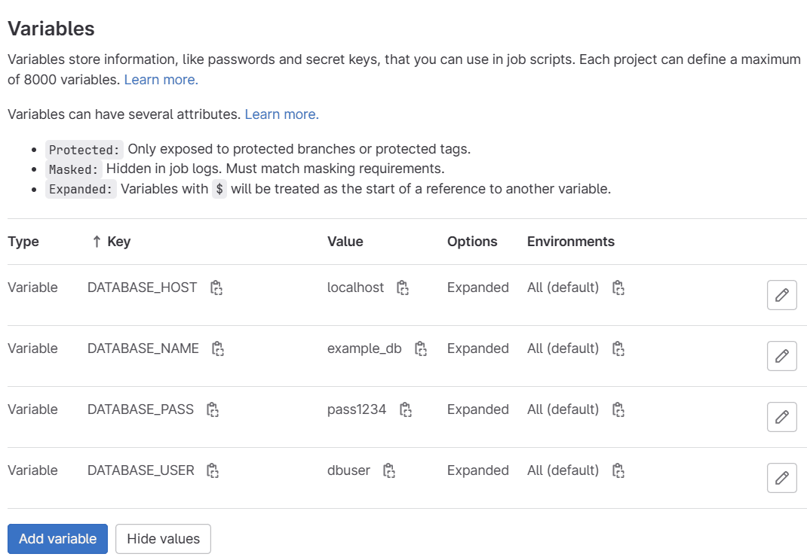

# GlabENV

CLI to export and synchronize Gitlab environment variables



## How To Install 🚀

Via NPM:

```bash
npm install -g glabenv
```

## Gitlab Authentication 🔐

Set the GitLab access token with the `--token` or `-t` option:

```bash
glabenv --token <YOUR_GITLAB_ACCESS_TOKEN>
```

Alternatively, you can use an environment variable:

```bash
export GLABENV_ACCESS_TOKEN=<YOUR_GITLAB_ACCESS_TOKEN>
```

## Commands 🛠️

### Export

To export all environment variables from a GitLab repository, you need to set the repository URL with the `--repoURL` or `-r` option:

```bash
glabenv export -r <YOUR_GITLAB_REPO_URL>
# Output :
# DATABASE_HOST=localhost
# DATABASE_USER=dbuser
# ...
```

You can also set the repository URL as an environment variable:

```bash
export GLABENV_REPOSITORY=<YOUR_GITLAB_REPO_URL>
glabenv export
# Output :
# DATABASE_HOST=localhost
# DATABASE_USER=dbuser
# ...
```

You can write the output to a file with `--output` or `-o` option:

```bash
glabenv export -o env.example
cat env.example
# Output :
# DATABASE_HOST=localhost
# DATABASE_USER=dbuser
# DATABASE_PASS=pass1234
# DATABASE_NAME=example_db
```

You can get the output as JSON format with the `--format` or `-f` option. The default format is `env`:

```bash
glabenv export -f json
# Output :
#[{"variable_type":"env_var","key":"DATABASE_HOST","value":"localhost","protected":false,"masked":false...
```

If you want the JSON output in a pretty format, use the `--pretty` option:

```bash
glabenv export -f json --pretty
# Output :
# [
#   {
#     "variable_type": "env_var",
#     "key": "DATABASE_HOST",
#     "value": "localhost",
#     "protected": false,
#     "masked": false,
#     "raw": false,
#     "environment_scope": "*"
#   },
# ...
```

### Export

To synchronize environment variables from your local env file to a GitLab repository:

```bash
glabenv sync --filepath env.example
```

Synchronization behavior:

- Create a new variable if there is a key in the local env file that doesn't exist in GitLab env variables.
- Update the variable if the value of the key in the local env file doesn't match the one in GitLab env variables.
- Delete the variable if there is a key in GitLab env variables that doesn't exist in the local env file.

## What's Next? 🤔

- [x] Synchronize local file to Gitlab repostiory
- [ ] Export environment variables from Gitlab Admin
- [ ] Export environment variables from Gitlab group

## References 📝

- https://docs.gitlab.com/ee/api/projects.html#get-single-project
- https://docs.gitlab.com/ee/api/project_level_variables.html#list-project-variables
- https://docs.gitlab.com/ee/api/project_level_variables.html#create-a-variable
- https://docs.gitlab.com/ee/api/project_level_variables.html#update-a-variable
- https://docs.gitlab.com/ee/api/project_level_variables.html#delete-a-variable
